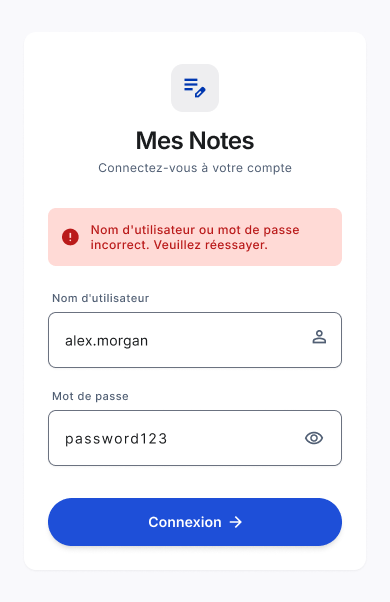
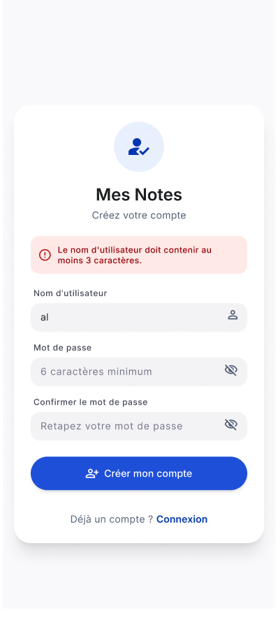
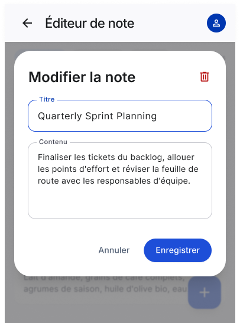
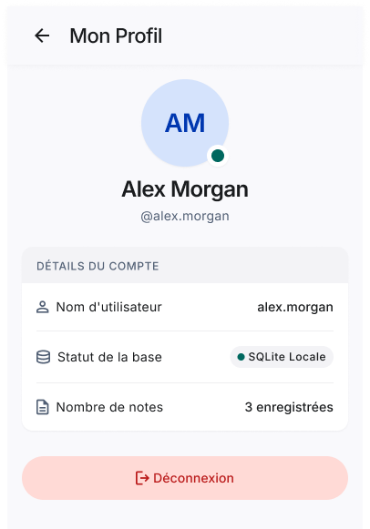

# Mes Notes - Application de Gestion de Notes Local

Une application mobile Flutter minimaliste et éco-conçue pour la gestion efficace de notes et tâches au quotidien. Développée dans le cadre de la formation D-CLIC / OIF (Semaine 6 - Niveau Intermédiaire).

---

## Aperçu des Interfaces

| Connexion | Inscription | Liste des Notes | Édition de Note | Mon Profil |
| :---: | :---: | :---: | :---: | :---: |
|  |  |  |  |  |

---

## Fonctionnalités

* **Authentification Locale :** Sécurisation de l'accès via nom d'utilisateur et mot de passe enregistrés localement.
* **Gestion complète de Notes (CRUD) :**
  * Création, modification, consultation et suppression de notes.
  * Statut de complétion (À faire / Terminée via Checkbox).
  * Horodatage automatique de la date et l'heure.
* **Recherche & Filtrage :**
  * Barre de recherche dynamique par mot-clé.
  * Filtres rapides : *Toutes*, *À faire*, *Terminées*.
* **Gestion du Profil Utilisateur :**
  * Consultation des informations du compte connecté et statistiques locales.
  * Option de déconnexion sécurisée.
* **Expérience Utilisateur & Écoconception :**
  * Design épuré basé sur Material 3.
  * Pas d'appels réseau inutile (100% Hors-ligne / Stockage local SQLite).
  * Messages d'erreur et dialogues de confirmation explicites.

---

## Stack Technique & Architecture

* **Framework :** [Flutter](https://flutter.dev/) (Dart)
* **Base de Données Locale :** [SQLite](https://pub.dev/packages/sqflite) (`sqflite`)
* **Design & UI :** Material Design 3
* **Gestion de Version :** Git avec conventions *Conventional Commits*

---

## Modèle de Données (SQLite)

L'application s'appuie sur deux tables principales :

```sql
-- Table Utilisateurs
CREATE TABLE users (
  id INTEGER PRIMARY KEY AUTOINCREMENT,
  username TEXT NOT NULL UNIQUE,
  password TEXT NOT NULL
);

-- Table Notes
CREATE TABLE notes (
  id INTEGER PRIMARY KEY AUTOINCREMENT,
  user_id INTEGER FOREIGN KEY REFERENCES users(id),
  title TEXT NOT NULL,
  content TEXT,
  is_done INTEGER DEFAULT 0,
  created_at TEXT NOT NULL
);

```

---

## Installation & Lancement

1. **Cloner le projet :**
```bash
git clone https://github.com/DavFilsDev/mes-notes-app.git
cd mes_notes_app
```


2. **Installer les dépendances :**
```bash
flutter pub get
```


3. **Exécuter l'application :**
```bash
flutter run
```


---

## Principes d'Écoconception

* **Stockage 100% Local :** Empreinte carbone réseau nulle grâce à l'utilisation exclusive de SQLite.
* **Composants Épurés :** Optimisation du nombre de re-builds de widgets pour réduire l'utilisation du processeur/batterie.